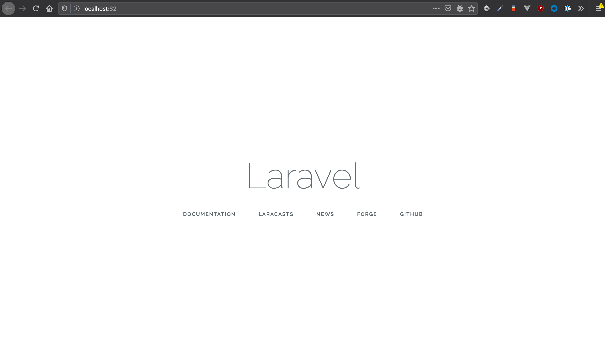

# Laravel multi-theme 

Implementation of laravel multi-theme package [yaap/theme](https://packagist.org/packages/yaap/theme).

## How to get started?

Before you begin, please ensure [Docker](https://www.docker.com/), [Docker Compose](https://docs.docker.com/compose/), [Helm](https://helm.sh/) and [Kubernetes](https://github.com/dambergautam/docker-examples/blob/master/4-kubernetes/kubernetes-setup.md) are installed and Docker is running.

**Step 1:**

Clone this project `git clone https://github.com/dambergautam/laravel-multi-theme.git`.

**Step 2:**

Run below command to add blank laravel project from root directory.

```
bash ./bin/install.sh
```

This command will
- install new laravel project `docker/laravel`
- create docker images and run containers  
- perform series of Laravel Artisan and NPM commands in the container.

To access website locally, visit http://localhost:84/.



